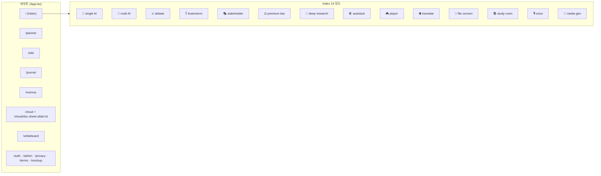

# Personai 사이트 맵 — 한눈에 보기

> 작업·분석 시 "이 기능 어디 있더라" 빠르게 찾기용. 코드 변경하면 같이 갱신.
> 마지막 갱신: 2026-05-11

---

## ⚡ 30초 요약

**스택:** React 18 + Vite 5 + TypeScript + Tailwind + shadcn/Radix + Supabase Auth + Vercel Serverless Functions

**큰 그림:** SPA 하나 안에 14개 AI 모드 + 8개 도메인 페이지 + 클라우드 협업이 한 줌. 거의 모든 데이터는 **localStorage / IndexedDB**, 일부만 Supabase·API.



---

## 🗺 라우트 맵

| Path | Page | 핵심 책임 |
|---|---|---|
| `/` | `src/pages/Index.tsx` | **AI 채팅 허브** — 14개 모드 탭 전환 (MainModeTabs) |
| `/planner` | `src/pages/Planner.tsx` (894줄) | 통합 플래너 — day/week/month/year/goals/habits + AI 컴패니언 |
| `/wiki` | `src/pages/Wiki.tsx` | 마이위키 — 노션 스타일 블록 에디터 + 백업/히스토리 |
| `/journal` | `src/pages/Journal.tsx` | 일기 — 무드/태그/주간보드/연간 픽셀 |
| `/memos` | `src/pages/Memos.tsx` | 메모 풀 페이지 (Planner 의 MemoDrawer 와 share store) |
| `/cloud` | `src/pages/Cloud.tsx` | Google Drive 류 — Doc/Sheet/Slide 에디터 |
| `/cloud/doc/:id` | `CloudDocEditor.tsx` | Tiptap 문서 |
| `/cloud/sheet/:id` | `CloudSheetEditor.tsx` | 스프레드시트 |
| `/cloud/slide/:id` | `CloudSlideEditor.tsx` | 프레젠테이션 |
| `/whiteboard` | `src/pages/Whiteboard.tsx` | 화이트보드 — 자유 드로잉/도형 |
| `/auth` · `/admin` | `Auth.tsx` · `Admin.tsx` | Supabase 인증·관리자 |
| `/mockup` · `/privacy` · `/terms` | — | 정적/실험 페이지 |

---

## 🎛 Index 14개 AI 모드

`src/types/expert.ts` 의 `MAIN_MODE_LABELS` 기준. UI 진입점은 `MainModeTabs.tsx` (또는 `ModePaletteModal.tsx` ⌘K).

| 코드 | 라벨 | 핵심 컴포넌트 | API |
|---|---|---|---|
| `general` | 💬 단일 AI | `Index.tsx` chat surface | `api/chat.ts` |
| `multi` | 🔄 다중 AI | `Index.tsx` + multi-expert orchestration | `api/chat.ts` |
| `debate` | ⚔️ AI 토론 | `DiscussionMessage.tsx`, `DiscussionHistory.tsx` | `api/chat.ts` + `api/debate-judge.ts` |
| `brainstorm_main` | 💡 브레인스토밍 | `AssistantCardsPanel.tsx` (협업 카드) | `api/chat.ts` |
| `stakeholder_main` | 🎭 AI 리허설 | `Index.tsx` 시뮬레이션 surface | `api/sim-orchestrator.ts` |
| `premium_main` | ⚖️ AI 법률 자문 | `PremiumConsultChat.tsx` | `api/premium-consult.ts` + `api/law-search.ts` |
| `research_main` | 🔬 심층 리서치 | `DeepResearchChat.tsx` | `api/deep-research.ts` + `api/clarify-topic.ts` |
| `assistant` | 🛠️ 어시스턴트 | `AssistantCardsPanel.tsx` | (전문가 별 라우팅) |
| `player` | 🎮 플레이어 | `GamePlayer.tsx` | 게임 로직 클라이언트 |
| `translate_main` | 🌐 다국어 번역 | `TranslateChat.tsx` | `api/chat.ts` + `src/lib/translate/` |
| `convert_main` | 📁 파일 변환 | `FileConvertChat.tsx` | 브라우저 변환 (`src/lib/fileConvert/`) |
| `study_main` | 📚 AI 스터디룸 | `src/components/study/*` (33개) | `api/study-generate.ts`, `study-transcribe.ts`, `study-vision-extract.ts` |
| `voice_main` | 🎙️ 음성 분석 | `src/components/voice-analysis/*` | `api/voice-analyze.ts`, `voice-transcribe.ts` |
| `media_main` | 🎨 이미지·동영상 | `src/components/media-gen/*` | `api/general-image.ts`, `media-video-create.ts`, `media-video-status.ts` |

### 모드 시그니처 컬러 (index.css `--mode-*`)
indigo(general) · violet(multi) · blue/red(debate-a/b) · emerald(simulation) · dark gold(premium) · deep navy(research) · amber(study) · cyan(assistant)

---

## 📂 도메인 페이지별 구조

### `/planner` — 통합 플래너 (49 컴포넌트)
```
src/components/planner/
├─ PlannerLeftRail.tsx      ← 48px 좌측 아이콘 rail
├─ PlannerSidebar.tsx       ← (얇은 본체)
├─ ai/                       ← AI 컴패니언 (5 파일)
│  ├─ PlannerAIPanel.tsx     · 우측 슬라이드 280-560px
│  ├─ AIQuickActions.tsx     · 추천 카드
│  ├─ AIComposer.tsx · AIMessage.tsx · AIActionCard.tsx
├─ TodayTimeline.tsx        ← ★ 944줄 (24h 격자 + DnD + ContextMenu)
├─ TodayScheduledList.tsx · TodayTodoList.tsx · TodayPlanPanel.tsx
├─ WeekView.tsx · MonthView.tsx · YearView.tsx
├─ GoalProgressView.tsx · HabitsView.tsx · 13×Habit*.tsx
├─ Inbox.tsx · Overdue.tsx · MemoDrawer.tsx · WikiDrawer.tsx · JournalDrawer.tsx
├─ PlannerInput.tsx (NL 파싱) · TaskScheduleDialog.tsx (748줄 — 할일/일정 모달)
├─ PlannerCommandPalette.tsx (⌘K) · ShortcutHelpDialog.tsx
└─ dnd/ DraggableBlock·InboxCard, DroppableDayColumn·Inbox·TimeSlot
```
**데이터:** 9개 store, 전부 localStorage (`src/services/planner/`)
- `taskStore` (할 일+일정 통합 — startAt 유무로 도메인 구분)
- `eventStore` (레거시), `habitStore` + `habitCheckinStore`, `goalStore`
- `pomodoroStore` + `pomodoroSessionLog`, `taskListStore`, `ddayStore`
- 도메인 규칙: `src/lib/planner/taskDomain.ts` (sanitize)

**훅:** `src/hooks/planner/` 11개 (useTodayTasks, usePlannerToday, usePlannerRange, useInbox, useOverdue, useHabits, …)

### `/wiki` — 마이위키 (25 컴포넌트)
- 블록 기반 에디터 (`src/lib/wikiBlocks.ts`)
- AI 패널 (`WikiAiPanel.tsx`)
- 백업·히스토리: `wikiBackup.ts`, `wikiHistory.ts`, `wikiBackupMeta.ts`
- 스타터 팩: `wikiStarterPacks.ts`, `wikiSeed.ts`
- 이미지: `wikiImageStore.ts` (IndexedDB)

### `/journal` — 일기 (16 컴포넌트)
- 메인: `Journal.tsx`
- 핵심: `JournalCard`, `JournalEditor`, `JournalWeekBoard`, `JournalYearPixels` (1년 픽셀 히트맵)
- 무드·활동·태그: `MoodPicker`, `ActivityPicker`, `TagInput`
- 인사이트: `JournalActivityInsights`, `JournalSummaryPanel`
- 스토어: `journalStore.ts` (메인) + `journalSummaryStore.ts`

### `/memos` — 메모 (3 컴포넌트 + 풀 페이지)
- 풀 페이지: `Memos.tsx` (편집·검색·휴지통·아카이브·정렬·하이라이트·이미지 카운트)
- 드로어: `planner/MemoDrawer.tsx` (Planner 안에서)
- 스토어: `lib/memoStore.ts` (localStorage) + `lib/memoImageStore.ts` (IndexedDB — 이미지 분리)
- 전역 단축키: `GlobalMemoHotkey.tsx` (Alt+M)

### `/cloud` — 클라우드 협업 (Doc/Sheet/Slide)
- 진입: `Cloud.tsx` (드라이브 뷰)
- 에디터: `CloudDocEditor`, `CloudSheetEditor`, `CloudSlideEditor`
- 라이브러리: `src/lib/cloudDoc/`, `cloudSheet/`, `cloudSlide/`, `cloudCommon/`, `cloudAi/`
- API: `api/cloud-ai.ts`, `cloud-ai-stream.ts`
- 클라이언트: `lib/cloudClient.ts`, hook: `useCloudNodes.ts`

### `/whiteboard` — 화이트보드
- `lib/whiteboard/`, `lib/whiteboardStore.ts`, 컴포넌트는 거의 페이지에 임베드

### MySpace (Index 안의 위젯 영역)
- `src/components/MySpace/MySpacePanel.tsx` + `widgets.tsx` + serendipity 카드
- 스토어: `lib/mySpaceStore.ts`

### Daily Briefing (Index 상단)
- `DailyBriefingMount.tsx`, `briefing/` 3 컴포넌트
- `lib/dailyBriefingStore.ts`, `briefingApi.ts`, `briefingApiClients.ts`, `buildBriefingData.ts`

---

## 💾 데이터 저장소 매트릭스

| 도메인 | localStorage | IndexedDB | Supabase | 외부 API |
|---|---|---|---|---|
| 채팅 히스토리 | `discussionHistoryStore` | — | — | — |
| 플래너 (9 store) | ✅ 전부 | — | ❌ 미연동 | — |
| 위키 | `wikiStore`, `wikiMainDocBody`, `wikiHistory` | `wikiImageStore` | — | — |
| 메모 | `memoStore` | `memoImageStore` | — | — |
| 일기 | `journalStore`, `journalSummaryStore` | — | — | — |
| 클라우드 | metadata | 본문/이미지 | Auth만 | — |
| 화이트보드 | `whiteboardStore` | — | — | — |
| MySpace | `mySpaceStore` | — | — | — |
| 게임 진행도 | `gameProgress` | — | — | — |
| 북마크 | `bookmarkStore` | — | — | — |
| Daily briefing | `dailyBriefingStore` | — | — | 외부 (`briefingApiClients`) |
| 파일 변환 | `fileConvert/favorites,history` | — | — | 브라우저 변환 |
| AI 사용량 | `usageTracker` | — | — | — |
| 전문가 설정 | `expertOverrides`(persist) | — | — | — |

**리스크:** 거의 모든 사용자 데이터가 브라우저 안 → 디바이스 간 sync 없음, 캐시 클리어 시 전손.

---

## 🛣 API 라우트 (`api/`)

```
chat.ts                    ← 메인 LLM 라우터 (OpenRouter)
clarify-chat.ts            ← 모호한 질문 명확화
clarify-topic.ts           ← 리서치 토픽 정교화
debate-judge.ts            ← 토론 판정
deep-research.ts           ← 심층 리서치 오케스트레이션
sim-orchestrator.ts        ← 시뮬레이션/리허설 진행
premium-consult.ts         ← 법률 자문
procon-stance.ts           ← 찬반 입장 생성
search-context.ts          ← 검색 결과 + 컨텍스트
law-search.ts              ← 외부 법률 API
finance-data.ts            ← 외부 금융 API
drug-search.ts             ← 외부 의약 API
general-image.ts           ← 이미지 생성
media-enhance-prompt.ts    ← 미디어 프롬프트 강화
media-video-create.ts      ← 영상 생성 시작
media-video-status.ts      ← 영상 생성 상태 폴링
study-generate.ts          ← 요약·퀴즈·플래시카드·다이어그램
study-transcribe.ts        ← 오디오 전사
study-url-extract.ts       ← URL 추출
study-vision-extract.ts    ← OCR
voice-analyze.ts           ← 음성 분석
voice-generate.ts          ← TTS
voice-transcribe.ts        ← STT
cloud-ai.ts · cloud-ai-stream.ts ← 클라우드 에디터 AI
```
공통 모듈: `api/_lib/`

---

## 🌐 글로벌 셸 (모든 페이지 공통)

```
AppSidebar.tsx              ← 사이트 좌측 사이드바
MainModeTabs.tsx            ← Index 의 14모드 탭
CommandPalette.tsx          ← ⌘K 글로벌 명령
ModePaletteModal.tsx        ← 모드 picker
PageSwitcher.tsx · NavLink.tsx
GlobalMemoHotkey.tsx        ← Alt+M 새 메모
DailyBriefingMount.tsx      ← 진입 시 브리핑
OnboardingTour.tsx          ← 첫 사용자 가이드
AppErrorBoundary.tsx · ModeErrorBoundary.tsx
EasterEgg.tsx
```

**디자인 토큰:** `tailwind.config.ts` (6단 typography: nano/caption/body/subhead/title/display) + `src/index.css` (HSL CSS vars: light/dark, surface 1-3, mode signature 9색, expert 8색, focus ring)

---

## 🔍 자주 손대는 곳 cheat sheet

| 하고 싶은 것 | 가야 할 곳 |
|---|---|
| 새 AI 모드 추가 | `types/expert.ts` `MAIN_MODE_LABELS` → `MainModeTabs.tsx` → `Index.tsx` surface |
| 모드 컬러 변경 | `index.css` `--mode-*` |
| 새 전문가 추가 | `EXPERTS_LIST.ts` (루트) + `expertSelectionGroups.ts` |
| 플래너 새 뷰 | `Planner.tsx` `ViewToggle` + 새 컴포넌트 |
| 플래너 새 store | `services/planner/` + sanitize 패턴 |
| 위키 새 블록 | `lib/wikiBlocks.ts` + 위키 에디터 |
| 새 API 엔드포인트 | `api/<name>.ts` (Vercel function) + 공통 `api/_lib/` |
| 단축키 추가 | 해당 페이지의 keydown 핸들러 (input/textarea/contentEditable 안에서는 비활성) |
| 토스트 | `src/lib/notify.ts` (`notify.success/error/info/warning`) — sonner 래핑 |
| 디자인 토큰 (radius/색) | `index.css` + `tailwind.config.ts` |
| 단축키 표시 | `components/shared/KbdHint` — OS 자동 (⌘ vs Ctrl) |
| 빈 상태 | `components/shared/EmptyState` — icon+title+desc+action |
| 로딩 셔머 | `components/shared/LoadingShimmer` |
| AI 사용량 뱃지 | `components/UsageStatBadge` |
| 숫자/바이트/상대시각 포맷 | `lib/formatters` |
| 디바운스 | `hooks/useDebouncedValue` |
| 시트 함수 추가 | `lib/cloudSheet/formula.ts` (FUNC_HELP + FUNC_ORDER + helper + new Function 등록 4곳) |
| 시트 sentinel 패턴 | IMAGE_SENTINEL / SPARKLINE_SENTINEL / AI_SENTINEL / SPILL_SENTINEL / LINK_SENTINEL |
| 시트 도메인 일관성 | `lib/planner/taskDomain.ts` (할 일/일정 sanitize) — 동일 패턴 |
| 플래너 시간 키 | `lib/planner/timeKeys.ts` (toDayKey / parseDayKey / shiftDayKey 등) |
| 피벗 엔진 | `lib/cloudSheet/pivot.ts` + UI `components/cloud/PivotDialog.tsx` |

---

## ⚠️ 알려진 큰 기술 부채

1. **데이터 영속성** — 9+ store 가 localStorage only. Supabase auth 있지만 미연동.
2. **거대 파일** — `TodayTimeline.tsx` 944줄, `Planner.tsx` 894줄, `TaskScheduleDialog.tsx` 748줄, `Memos.tsx` 1000+줄
3. **시간 변환 로직 산재** — `Planner.tsx`, `TodayTimeline.tsx`, `transposeTimeToDate`, `nextHalfHourSlot` 등에 흩어짐
4. **레거시 잔재** — `eventStore` 가 taskStore 로 마이그레이션 진행 중이지만 미완료
5. **테스트 커버리지** — `recurrence` 등 일부 미커버 (커버: taskStore, habitStats, journalStore, taskDomain, parseNaturalLanguage, timeKeys, formatters, useDebouncedValue, cloudSheet formula/sparkline/xlsx/pivot/aiCell/spill 등 200+ cases)
6. **번들 사이즈** — mermaid (530KB), mammoth (500KB) 등 무거운 라이브러리 정적 import. 코드 스플릿 여지

---

## 📐 코드 컨벤션 (관찰)

- 한국어 JSDoc 풍부 (의도·트레이드오프·주의사항 명시)
- shadcn/Radix 프리미티브 + Tailwind utility-first
- Store 패턴: `safeRead` + `safeWrite` + `safe*` 유효성 검사 + CustomEvent broadcast
- 결합도 낮춤: `RAIL_EVENT` 같은 상수 객체로 CustomEvent 이름 모음
- 패치 후 도메인 일관성 강제: `sanitizeForDomain` 같은 헬퍼 (taskStore 도입 완료)
